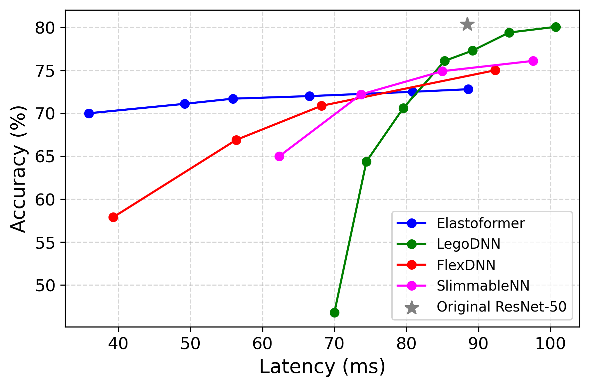

# Elastoformer: Enabling Dynamic Adaptivity via Elastic Model Transformation 🚀

**Elastoformer** is a cutting-edge framework that unlocks **dynamic adaptivity** in deep neural networks through **elastic model transformation**.

In today's diverse deployment environments, from powerful cloud servers to resource-constrained edge devices, a static Neural architecture is often inefficient. Especially in case of EdgeAI deployments which face highly dynamic operational conditions, with fluctuating constraints on latency, power availability, and memory resources, Deep Neural Networks (DNN), which a follow fixed computational execution flows, lack the flexibility to adapt to such variability, resulting in inefficient and suboptimal performance in edge scenarios. This underscores the need for architectures that are not only efficient but also dynamically scalable at runtime. Elastoformer solves this by treating a single, pre-trained network as an **"Elastic" Model** from which multiple, optimized descendants can be efficiently generated.

This framework achieves superior efficiency by supporting all major architectures: **Vision Transformers (ViTs)**, including models like **DeiT** and **ViT**, and **Convolutional Neural Networks (CNNs)**, such as **ResNet** and **VGG**.

---

## 💡 How It Works

Elastoformer streamlines the process of network compression and optimization:

* **Pruning:** Efficiently removes redundant weights and units from the core model.
* **Rebuilding:** Creates smaller, **Descendant Networks (DNs)** tailored to specific resource constraints.
* **Deploying:** Enables rapid deployment of these optimized DNs with minimal retraining effort, ensuring high accuracy is retained even after significant compression.

This capability allows you to generate a spectrum of models: from full-size to highly compressed, to match any target hardware precisely.


## Environment Setup
1. Clone the repository:
```bash
git clone https://github.com/yourusername/elastoformer.git
cd elastoformer
```
2. Install Dependencies:
```bash
pip install -r requirements.txt
```

## Usage
Here is the command for running the elastic transformation for DeiT [1]:
```
python main.py \
    --exp_name elastoformer \
    --dataset_name imagenet \
    --model_name facebook/deit-base-patch16-224 \
    --pruning_type l1 \
    --pruning_ratio 0.5 \
    --iterative --pruning_steps 5 \
    --data_path /path/to/dataset \
    --train_batch_size 512 \
    --val_batch_size 512 \
    --save_as /path/for/save/ \
    --test_accuracy \ 
    --rebuild \
    --epochs 50 --core_epochs 50 --lr-warmup-epochs 10 --lr 5e-5 \
    --mixup-alpha 0.2 --core_weight_decay 0.05 --stochastic_depth \
    --clip-grad-norm 1 --amp --ra-sampler \
    --distributed --model-ema --log_wandb \
```
Similarly for Elastic CNN's replace main.py with elastic_cnn.py:
```
python elastic_cnn.py \
    --exp_name Elastic_Resnet50 \
    --dataset_name imagenet \
    --model_name resnet50 \
    --weights ResNet50_Weights.IMAGENET1K_V2 \
    --pruning_type l1 \
    --pruning_ratio 0.5 \
    --iterative --pruning_steps 5 \
    --taylor_batchs 10 \
    --data_path /nvmestore/koelma/pytorch_work/ilsvrc2012/ \
    --train_batch_size 128 \
    --val_batch_size 128 \
    --save_as saves/state_dicts/ \
    --test_accuracy \
    --rebuild \
    --epochs 50 --core_epochs 50 --lr-warmup-epochs 5 --lr 0.05 \
    --mixup-alpha 0.8 --core_weight_decay 1e-4 --stochastic_depth \
    --clip-grad-norm 1 --amp --ra-sampler \
    --distributed --model-ema --log_wandb \
```
where:
- `--dataset_name`: [`imagenet`, `cifar10`, `cifar100`, `dummy`].
- `--model_name`: `network architecture [DeiT: "facebook/deit-base-patch16-224", ViT: "google/vit-base-patch16-224", Resnet: "resnet50", VGG: "vgg16" etc..], (ViT models are named as per HuggingFace ModelHub [2])`
- `--weights`: `Pre-trained weights identifier as per Torchvision (only applicable for CNNs/Torchvision models)` .
- `--pruning_type`: [`l1`, `l2`, `taylor`, `hessian`].
- `--pruning_ratio`: `Between (0,1) for the level of compression, 1 being max compression`.
- `--iterative`: `Flag for multiple step of elasticity (always True)`.
- `--pruning_steps`: `Desired number of Descendant Networks (DNs), Note: # DN's = pruning_steps + 1`.
- `--rebuild`: `Flag for retraining of DNs (always True)`.

## Results

| Accuracy vs FLOPs | Latency vs FLOPs (Orin) |
|-------------------|--------------------------|
|  |  |

| Latency vs FLOPs (Nano) | ResNet-50 Latency (Nano) |
|--------------------------|---------------------------|
|  |  |

## Checkpoints
We have stored the checkpoints for the trained models in the below link:
https://surfdrive.surf.nl/s/BJ52qJHyWAYfwct


## References
- [1. DeiT Paper](https://arxiv.org/abs/2012.12877)
- [2. HuggingFace ViT Models](https://huggingface.co/models)
